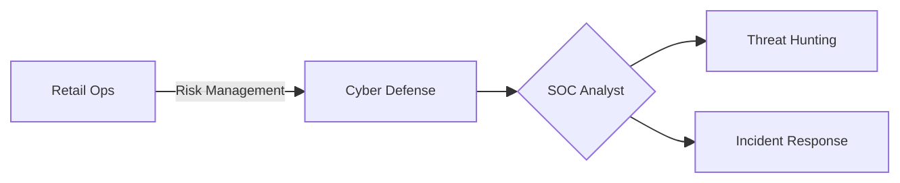

# **Kyle Gill – Junior Cybersecurity Analyst & Digital Defender**  
#### 🛡️ Transitioning Retail Operations Leader
##### 🔍 SOC Analyst | Threat Hunter | Incident Responder  

# Welcome to My Cybersecurity Portfolio!

I specialize in **SOC operations, threat detection, and incident response**—leveraging analytical skills to **monitor, analyze, and secure digital infrastructures**.

With hands-on experience in **network monitoring, vulnerability assessments, and SIEM analysis**, I excel at **identifying threats, mitigating risks, and strengthening security postures**. This portfolio showcases my **expertise in log analysis, penetration testing, and asset discovery**, demonstrating my ability to **detect, analyze, and respond to cyber threats effectively**.

---  
## **🚀 Operational Excellence Meets Cyber Defense**  
✅ **5+ years retail leadership** → **Security Operations Center readiness**  
✅ **$5M+ inventory management** → **Enterprise asset protection**  
✅ **Team leadership** → **Incident response coordination**  

## **🔹 Navigation**  

  <a href="projects.md" style="text-decoration: none; color: #0366d6; font-weight: bold;">📂 Projects</a>
  <a href="certifications.md" style="text-decoration: none; color: #0366d6; font-weight: bold;">🎓 Certifications</a>

  

---  

## **🛡️ Certifications & Training**  
🎯 **CompTIA Security+ (In Progress)**  
📌 **Cybersecurity Bootcamp – TripleTen**  
📌 **Google Cybersecurity Certificate**

  

---  

## **🛠️ Cyber Defense Matrix**  

### **🔍 Threat Operations**  

  

    <h4>🛡️ Incident Response</h4>
    

      Playbooks Developed
      98% Accuracy
    

    

      Phishing | Ransomware | DDoS 
      <a href="projects.md#incident-response" style="color: #2A9D8F; text-decoration: none;">↗️ View Simulation Results</a>
    

  

  

    <h4>🌐 Network Defense</h4>
    

      Topology Analysis
      40% Risk Reduction
    

    

      Wireshark | Nessus | Nmap 
      <a href="projects.md#network-audit" style="color: #2A9D8F; text-decoration: none;">↗️ Audit Samples</a>
    

  

### **⚡ Attack Surface Management**  

  

    <h4>🎯 Vulnerability Operations</h4>
    

      

        

      

      85% Remediation Rate
    

    

      CVSS Scoring | Patch Management 
      <a href="projects.md#vulnerability-mgmt" style="color: #2A9D8F; text-decoration: none;">↗️ Case Studies</a>
    

  

  

    <h4>📜 Compliance Framework</h4>
    

      NIST
      ISO 27001
      GDPR
      HIPAA
    

    

      Risk Assessment | Business Continuity 
      <a href="projects.md#compliance" style="color: #2A9D8F; text-decoration: none;">↗️ Framework Analysis</a>
    

  

---  

## **📬 Contact Me**  
I'm actively seeking **SOC Analyst, Incident Response, or Cybersecurity Specialist** roles. Let's connect!  

📧 [kylegill30@yahoo.com](mailto:kylegill30@yahoo.com)  
💼 [LinkedIn Profile](https://www.linkedin.com/in/kylesportfolio/) 

---  
