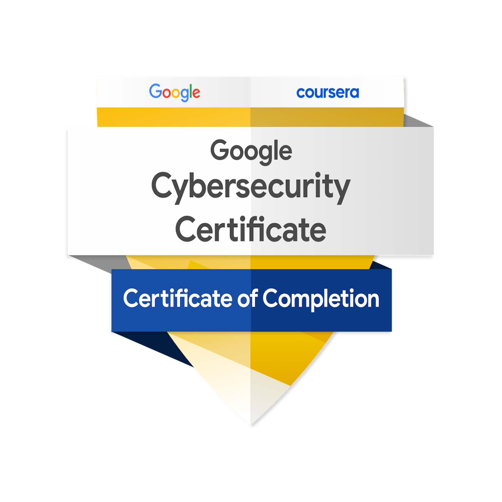

# Kyle Gill – Cybersecurity Enthusiast & Digital Defender

Welcome to my cybersecurity portfolio! I’m passionate about protecting digital assets, uncovering vulnerabilities, and strengthening defenses against cyber threats. With a focus on security analysis, incident response, and ethical hacking, I thrive on solving complex security challenges and ensuring businesses stay resilient against evolving threats.

What You'll Find Here
This portfolio showcases my journey through hands-on cybersecurity projects, industry certifications, and my approach to securing modern infrastructures. From network hardening to penetration testing and real-world incident investigations, each project reflects my ability to think critically, analyze risks, and implement practical security solutions.

---
## Navigation

  <a href="projects.md" style="text-decoration: none; color: #0366d6; font-weight: bold;">Projects</a>
  <a href="certifications.md" style="text-decoration: none; color: #0366d6; font-weight: bold;">Certifications</a>
  <a href="#contact" style="text-decoration: none; color: #0366d6; font-weight: bold;">Contact</a>

---

<!-- More overview content as needed -->
## Certifications

Below are some of my key certifications:

---
## **Projects & Key Areas of Expertise**  

### 🔹 **Network Security & Hardening**  
- Conducted **security audits** and implemented **best practices** to fortify network infrastructures.  
- Evaluated **network topologies**, identified vulnerabilities, and optimized security postures.  

### 🔹 **Threat Analysis & Incident Response**  
- Developed **incident response playbooks** for phishing, ransomware, and DDoS attacks.  
- Investigated **real-world cybersecurity incidents**, distinguishing false positives from genuine threats.  

### 🔹 **Vulnerability Management & Penetration Testing**  
- Performed **vulnerability assessments**, identifying and prioritizing security gaps.  
- Executed **penetration tests** to validate exploitability and assess real-world risk impact.  

### 🔹 **Security Frameworks & Compliance**  
- Assessed cybersecurity postures using **NIST CSF** and **industry standards**.  
- Created strategic **risk mitigation plans** to enhance business continuity.  

## **Certifications & Training**  
🚀 **CompTIA Security+ Certification (In Progress)**  
📌 Cybersecurity Bootcamp – **TripleTen**  
## Contact

For inquiries, please email me at [kylegill30@yahoo.com](mailto:kylegill30@yahoo.com).
