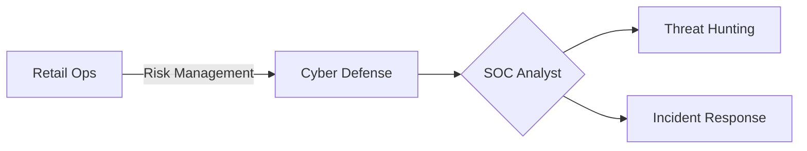

# **Kyle Gill – Cybersecurity Enthusiast & Digital Defender**  
#### 🛡️ Transitioning Retail Operations Leader → Aspiring Cybersecurity Defender  
##### 🔍 SOC Analyst | Threat Hunter | Incident Responder  

Welcome to my cybersecurity portfolio! I specialize in **SOC operations, threat detection, and incident response**, leveraging analytical skills to **monitor, analyze, and secure digital infrastructures**.  

With hands-on experience in **network monitoring, vulnerability assessments, and SIEM analysis**, I excel in **identifying threats, mitigating risks, and strengthening security postures**. This portfolio showcases my **expertise in log analysis, penetration testing, and asset discovery**, demonstrating my ability to **detect, analyze, and respond to cyber threats effectively**.  

---  
## **🚀 Operational Excellence Meets Cyber Defense**  
✅ **5+ years retail leadership** → **Security Operations Center readiness**  
✅ **$5M+ inventory management** → **Enterprise asset protection**  
✅ **Team leadership** → **Incident response coordination**  
✅ **Loss prevention strategies** → **Threat mitigation frameworks**

## **🔹 Navigation**  

  <a href="projects.md" style="text-decoration: none; color: #0366d6; font-weight: bold;">📂 Projects</a>
  <a href="certifications.md" style="text-decoration: none; color: #0366d6; font-weight: bold;">🎓 Certifications</a>
  <a href="contact.md" style="text-decoration: none; color: #0366d6; font-weight: bold;">📩 Contact</a>

  

---  

## **🛡️ Certifications & Training**  
🎯 **CompTIA Security+ (In Progress)**  
📌 **Cybersecurity Bootcamp – TripleTen**  
📌 **Google Cybersecurity Certificate**

  

---  

## **💡 Key Areas of Expertise & Projects**  

### **🕵️ Threat Analysis & Incident Response**  
✅ Created **incident response playbooks** for phishing, ransomware, and DDoS attacks.  
✅ Investigated **real-world security incidents**, distinguishing false positives from threats.  

### **🔐 Network Security & Hardening**  
✅ Conducted **security audits** and implemented **best practices** to fortify networks.  
✅ Evaluated **network topologies**, identifying vulnerabilities and optimizing security postures.  

### **⚡ Vulnerability Management & Penetration Testing**  
✅ Performed **vulnerability assessments**, identifying and prioritizing security gaps.  
✅ Executed **penetration tests** to validate exploitability and assess real-world risk impact.  

### **📜 Security Frameworks & Compliance**  
✅ Assessed cybersecurity postures using **NIST CSF** and industry standards.  
✅ Created strategic **risk mitigation plans** to enhance business continuity.  

---  

## **📬 Contact Me**  
I'm actively seeking **SOC Analyst, Incident Response, or Cybersecurity Specialist** roles. Let's connect!  

📧 [kylegill30@yahoo.com](mailto:kylegill30@yahoo.com)  
💼 [LinkedIn Profile](https://www.linkedin.com/in/kylesportfolio/) 

---  
