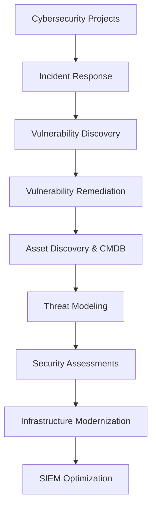

# 🚀 **Cybersecurity Projects**

### **Hands-on Security Implementations & Real-World Problem Solving**

This page showcases my cybersecurity expertise, organized to highlight real-world impact and practical experience—tailored specifically to demonstrate readiness for an **SOC Analyst** role.

---

## 📊 **Skill Proficiency Snapshot**

---

## 🛠️ **Tools & Technologies Used Across Projects**

`Wireshark` | `Metasploit` | `Nmap` | `Splunk` | `pfSense` | `Burp Suite` | `SIEM Analysis` | `Python` | `Wazuh` | `Sysmon` | `Atomic Red Team` | `iTop CMDB` | `Group Policy (GPO)` | `ATT&CK Simulation` | `Incident Response Playbooks`

---

## 🧠 **Advanced Detection Engineering & SIEM Optimization**

**Applied techniques for log source expansion, custom rule creation, and adversary emulation to enhance detection within Wazuh.**

### 🧪 **PowerShell Log Source Integration with Wazuh (Sprint 11 Project)**

🔹 Integrated PowerShell Operational logs into Wazuh using GPO, custom `ossec.conf` entries, and tailored Wazuh detection rules. Simulated real-world adversary behavior via Atomic Red Team to validate log visibility, including obfuscation (T1027), fileless execution, and mshta-based download cradles.

[🔍 Detailed Project](projects/sprint11_wazuh_logsource.md)

---

## 🕷️ **MegaQuagga Project Series**

**Logical Progression:** Initial vulnerability identification ➡️ penetration testing ➡️ vulnerability remediation ➡️ asset discovery & continuous monitoring.

### 1️⃣ **MegaQuagga Publishing Penetration Test**

🔹 Conducted full-stack ethical hacking, uncovering critical vulnerabilities and validating firewall security.

[🔍 Detailed Project](projects/MegaQuagga_pentesting_report_preparation.md)

### 2️⃣ **Vulnerability Remediation for MegaQuagga**

🔹 Implemented web application firewall, SSL encryption, and proactive defenses to remediate critical vulnerabilities and enhance security posture.

[🔍 Detailed Project](projects/Vulnerability%20Remediation%20for%20MegaQuagga.md)

### 3️⃣ **Enterprise Asset Discovery & CMDB Implementation for MegaQuagga**

🔹 Conducted comprehensive asset enumeration using Nmap and integrated findings into iTop CMDB, centralizing asset management for proactive threat detection.

[🔍 Detailed Project](projects/enterprise_asset_discovery.md)

---

## 🔥 **Incident Response & Threat Management**

### 🛡️ **Incident Response Plan Optimization for Capybara Unlimited**

🔹 Revitalized an outdated incident response plan aligning with NIST standards, enabling rapid threat containment and effective incident resolution.

[🔍 Detailed Project](projects/IRP_review_capybara_unlimited.md)

### 🧪 **Credential Stuffing Detection & Response (Sprint 12)**

🔹 Triaged a high-severity ModSecurity alert involving Hydra-driven credential stuffing targeting a WordPress login endpoint. Conducted packet analysis using Wireshark, enriched findings via Splunk queries, and authored a full IR report confirming privilege escalation through valid credential use.

[🔍 Detailed Project](https://github.com/EnoMada/EnoMada/blob/main/projects/Brute_force_detection.md)

---

## 🎯 **Threat Modeling & Security Assessments**

### 📋 **Security Posture Assessment**

🔹 Performed deep-dive security assessments, identifying threats and reducing risks through targeted improvements.

[🔍 Detailed Project](projects/assess-business-security-posture.md)

### 🎯 **Threat Modeling for Xibalba Interactive**

🔹 Implemented threat models to mitigate risks during feature deployments, enhancing security throughout the development lifecycle.

[🔍 Detailed Project](projects/threat_modeling_for_xibalba_interactive.md)

---

## 🌐 **Network & Infrastructure Modernization**

### 🖥️ **Tempus Fugit Timepieces Network Modernization**

🔹 Delivered secure, modernized network architecture emphasizing zero-trust principles and robust disaster recovery capabilities.

[🔍 Detailed Project](projects/tempus_fugit_network.md)

### 🌿 **Network Modernization for Yagé Botanicals**

🔹 Developed cost-effective network upgrades, cloud migration, and endpoint security solutions to streamline operations and enhance investor appeal.

[🔍 Detailed Project](projects/network_hardening_Yage_Botanicals.md)

---

## 📈 **Interactive Project Flowchart**

---

## 📬 **Let's Connect!**

🚀 Ready to discuss cybersecurity opportunities or collaborate?

📧 [Email Me](mailto:kylegill30@yahoo.com)
🔗 [LinkedIn](https://www.linkedin.com/in/kylesportfolio/)
