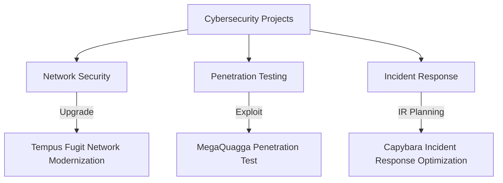

# 🚀 **Cybersecurity Projects**  
### **Hands-on Security Implementations & Real-World Problem Solving**  
This page showcases my cybersecurity expertise, with projects organized to highlight real-world impact and practical experience—tailored specifically to demonstrate readiness for an **SOC Analyst** role.

---

## 📊 **Skill Proficiency Snapshot**
  
  

---

## 🛠️ **Tools & Technologies Used Across Projects**
`Wireshark` | `Metasploit` | `Nmap` | `Splunk` | `pfSense` | `Burp Suite` | `SIEM Analysis` | `Python` | `Vulnerability Scanning` | `Incident Response Playbooks`

---

## 🔥 **1. Immediate Threat Management & Incident Response**  
**Why Start Here?** Incident response skills directly address immediate threats and are highly valued in SOC roles.

### 🛡️ **Incident Response Plan Optimization for Capybara Unlimited**  
🔹 Revitalized an outdated incident response plan by aligning it with NIST standards, enabling rapid threat containment and effective incident resolution.

  

[🔍 Detailed Project](projects/IRP_review_capybara_unlimited.md)

---

## 💀 **2. Vulnerability Discovery & Penetration Testing**  
**Why Next?** Demonstrates proactive threat identification and validation, a core function of effective SOC operations.

### 🕷️ **MegaQuagga Publishing Penetration Test**  
🔹 Conducted full-stack ethical hacking, uncovering critical vulnerabilities and validating firewall security.

  

[🔍 Detailed Project](projects/MegaQuagga_pentesting_report_preparation.md)

### 🎯 **Threat Modeling for Xibalba Interactive**  
🔹 Created and implemented comprehensive threat models to mitigate risks during feature deployments, enhancing security across development cycles.

  

[🔍 Detailed Project](projects/threat_modeling_for_xibalba_interactive.md)

---

## 🔎 **3. Comprehensive Security Evaluations**  
**Why Next?** Security evaluations establish a baseline for improvement, highlighting your analytical skills essential for a SOC Analyst.

### 📋 **Security Posture Assessment**  
🔹 Performed deep-dive security assessments identifying threats and reducing risks through targeted improvements.

  

[🔍 Detailed Project](projects/assess-business-security-posture.md)

---

## 🌐 **4. Infrastructure Enhancement & Modernization**  
**Why Next?** Infrastructure security directly impacts a company's resilience—crucial for SOC operations and overall risk management.

### 🖥️ **Tempus Fugit Timepieces Network Modernization**  
🔹 Delivered a secure, modernized network architecture emphasizing zero-trust principles and ensuring robust disaster recovery capabilities.

  

[🔍 Detailed Project](projects/tempus_fugit_network.md)

### 🌿 **Network Modernization for Yagé Botanicals**  
🔹 Developed cost-effective network upgrades, cloud migration, and endpoint security solutions to streamline operations and enhance investor appeal.

  

[🔍 Detailed Project](projects/network_hardening_Yage_Botanicals.md)

---

## 🔄 **5. Continuous Monitoring & Asset Management**  
**Why Last?** Emphasizes long-term management of cybersecurity posture—an essential, ongoing SOC Analyst responsibility.

### 🗂️ **Enterprise Asset Discovery & CMDB Implementation**  
🔹 Identified and classified assets, integrating detailed results into a CMDB for proactive monitoring and significant attack surface reduction.

  

[🔍 Detailed Project](projects/enterprise_asset_discovery.md)

---

## 📈 **Interactive Project Flowchart**  

---

## 📬 **Let's Connect!**  
🚀 Ready to discuss cybersecurity opportunities or collaborate?

📧 [Email Me](mailto:kylegill30@yahoo.com)  
🔗 [LinkedIn](https://www.linkedin.com/in/kylesportfolio/)
