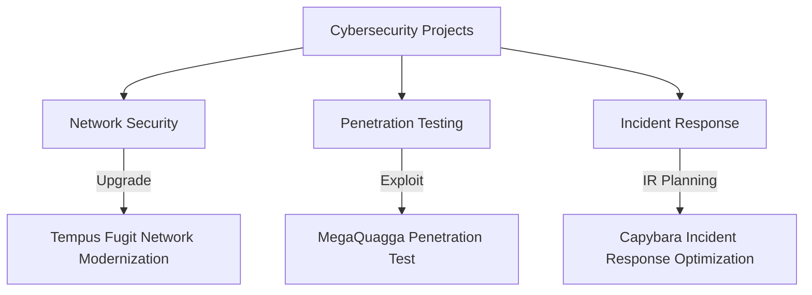

# **Cybersecurity Projects**  
🚀 **Hands-on Security Implementations & Real-World Problem Solving**  
This page showcases key projects from my cybersecurity training, demonstrating expertise in **incident response, vulnerability management, and threat detection**. Click on any project title to explore its technical breakdown and impact.  

---

## **📊 Skill Progress Across Projects**  
  
  
  

---

## 🔥 **Security Operations Center (SOC) & Risk Management**  
### **Security Posture Assessment**  
🔹 Applied advanced threat detection and risk management techniques to evaluate and enhance a small business’s security posture, ensuring robust protection against emerging threats.  

  
  

[🔍 View Detailed Project](projects/assess-business-security-posture.md)  

### **Incident Response Plan Optimization for Capybara Unlimited**  
🔹 Revitalized an outdated incident response plan by aligning it with NIST best practices, ensuring rapid and effective response to cybersecurity incidents.  

  
  

[🔍 View Detailed Project](projects/IRP_review_capybara_unlimited.md)  

---

## 💀 **Offensive Security & Penetration Testing**  
### **MegaQuagga Publishing Penetration Test**  
🔹 Executed full-stack security assessment through ethical hacking techniques, identifying critical vulnerabilities in web infrastructure and firewall configurations.  

  
  

[🔍 View Detailed Project](projects/MegaQuagga_pentesting_report_preparation.md)  

### **Threat Modeling for Xibalba Interactive**  
🔹 Designed and implemented a threat model to identify vulnerabilities and mitigate risks for a game development studio, ensuring secure deployment of new features.  

  
  

[🔍 View Detailed Project](projects/threat_modeling_for_xibalba_interactive.md)  

---

## 🌐 **Network & Cloud Security**  
### **Tempus Fugit Timepieces Network Modernization**  
🔹 Modernized legacy network infrastructure through architectural redesign and zero-trust principles, enhancing security and business valuation for acquisition readiness.  

  
  

[🔍 View Detailed Project](projects/tempus_fugit_network.md)  

### **Enterprise Asset Discovery & CMDB Implementation**  
🔹 Conducted comprehensive network scanning and asset classification to centralize security monitoring, improving visibility and reducing attack surfaces.  

  
  

[🔍 View Detailed Project](projects/enterprise_asset_discovery.md)  

### **Network Modernization for Yagé Botanicals**  
🔹 Engineered a cost-effective network modernization plan, including cloud migration and endpoint security improvements, to enhance operational efficiency and buyer appeal.  

  
  

[🔍 View Detailed Project](projects/network_hardening_Yage_Botanicals.md)  

---

## 🔗 **Interactive Project Flowchart**  

---

## 📡 **Tools & Technologies Used Across Projects**  
`Wireshark` | `Metasploit` | `Nmap` | `Splunk` | `pfSense` | `Burp Suite` | `SIEM Analysis` | `Python Scripting` | `Vulnerability Scanning` | `Incident Response Playbooks`  

---

## 📩 **Let's Connect**  
🚀 Interested in discussing cybersecurity? Connect with me!  
📧 [Email Me](mailto:kylegill30@yahoo.com)  
🔗 [LinkedIn](https://www.linkedin.com/in/kylesportfolio/)  

---
