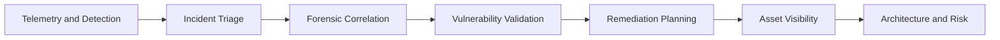

# Project Portfolio

This is the portfolio hub for the current GitHub profile. It is organized for quick review first, then deeper drill-down into individual project pages.

[Back to profile](README.md) | [Career snapshot](career-snapshot.md) | [Contact](contact.md)

---

## Portfolio Map

| Domain | Project | Type | Evidence | Link |
|---|---|---:|---:|---|
| Detection Engineering | PowerShell Log Source Integration with Wazuh | Guided Lab | E1 | [Open](projects/sprint11_wazuh_logsource.md) |
| Incident Response | Credential Attack Triage and Response | Guided Lab | E2 | [Open](projects/Brute_force_detection.md) |
| Incident Response / DFIR | Cerber Ransomware Triage and Forensic Correlation | Guided Lab | E2 | [Open](projects/cerber_ransomware_triage.md) |
| Vulnerability Management | MegaQuagga Penetration Validation | Coursework | E1 | [Open](projects/MegaQuagga_pentesting_report_preparation.md) |
| Vulnerability Management | MegaQuagga Vulnerability Remediation | Coursework | E1 | [Open](projects/Vulnerability%20Remediation%20for%20MegaQuagga.md) |
| Asset Visibility | MegaQuagga Asset Discovery and CMDB | Coursework | E1 | [Open](projects/enterprise_asset_discovery.md) |
| Incident Response Program | Capybara Incident Response Plan Review | Scenario Case Study | E1 | [Open](projects/IRP_review_capybara_unlimited.md) |
| Risk / Security Consulting | RCI Security Posture Assessment | Scenario Case Study | E1 | [Open](projects/assess-business-security-posture.md) |
| Threat Modeling | Xibalba Threat Modeling Case Study | Scenario Case Study | E1 | [Open](projects/threat_modeling_for_xibalba_interactive.md) |
| Security Architecture | Tempus Fugit Network Modernization | Scenario Case Study | E1 | [Open](projects/tempus_fugit_network.md) |
| Technical Operations | Yage Botanicals Infrastructure Modernization | Scenario Case Study | E1 | [Open](projects/network_hardening_Yage_Botanicals.md) |

## Flagship Track

```mermaid
flowchart LR
  A["Telemetry and Detection"] --> B["Incident Triage"]
  B --> C["Forensic Correlation"]
  C --> D["Vulnerability Validation"]
  D --> E["Remediation Planning"]
  E --> F["Asset Visibility"]
  F --> G["Architecture and Risk"]
```

## Detection Engineering

### [PowerShell Log Source Integration with Wazuh](projects/sprint11_wazuh_logsource.md)

Configured PowerShell Operational logging in a lab, documented Wazuh ingestion and detection-validation experiments, and used Atomic Red Team simulations as test inputs.

**Tools:** Wazuh, PowerShell logging, Windows Event logging, ATT&CK, Atomic Red Team

**Current evidence note:** Event 4688 handling still needs final correction before this case should be promoted as production-grade detection engineering.

## Incident Response and DFIR

### [Credential Attack Triage and Response](projects/Brute_force_detection.md)

Investigated a simulated WordPress login attack using WAF alerts, packet captures, and Splunk telemetry, then documented timeline, ATT&CK mapping, and response recommendations.

**Tools:** Splunk, Wireshark, ModSecurity, incident triage, ATT&CK

### [Cerber Ransomware Triage and Forensic Correlation](projects/cerber_ransomware_triage.md)

Correlated endpoint and network telemetry in a ransomware investigation scenario and documented a timeline, indicators, ATT&CK mapping, and response recommendations.

**Tools:** Splunk, Sysmon, CyberChef, OSINT, incident response

### [Capybara Incident Response Plan Review](projects/IRP_review_capybara_unlimited.md)

Reviewed a scenario incident response plan, identified governance gaps, and documented NIST-aligned recommendations and playbook concepts.

**Tools:** NIST CSF, IR planning, playbook design, stakeholder communication

## MegaQuagga Security Program

This series is presented as coursework and lab-based security lifecycle work. It should become a dedicated repository after source artifacts are recovered and rights are validated.

| Phase | Case | Focus |
|---|---|---|
| 1 | Future recovered vulnerability-assessment work | Scan evidence and initial findings |
| 2 | [Penetration Validation](projects/MegaQuagga_pentesting_report_preparation.md) | Controlled validation with Nmap, WPScan, Metasploit, and pfSense |
| 3 | [Vulnerability Remediation](projects/Vulnerability%20Remediation%20for%20MegaQuagga.md) | HTTPS, reverse proxy, ModSecurity, OWASP CRS, and firewall/NAT changes |
| 4 | [Asset Discovery and CMDB](projects/enterprise_asset_discovery.md) | Nmap, PowerShell, directory queries, and iTop CMDB documentation |

## Security Architecture and Risk

### [RCI Security Posture Assessment](projects/assess-business-security-posture.md)

Assessed a ransomware scenario, prioritized security gaps, and proposed a risk-based improvement roadmap.

### [Xibalba Threat Modeling Case Study](projects/threat_modeling_for_xibalba_interactive.md)

Modeled threats for a public web feature scenario, identified attack-surface concerns, and documented mitigation recommendations.

### [Tempus Fugit Network Modernization](projects/tempus_fugit_network.md)

Designed a modernization proposal for a legacy network scenario covering redundancy, secure remote access, cloud integration, and business continuity.

### [Yage Botanicals Infrastructure Modernization](projects/network_hardening_Yage_Botanicals.md)

Developed a cost-conscious infrastructure and security modernization proposal for a legacy-business acquisition scenario.

## How To Read Evidence Levels

| Level | Meaning |
|---|---|
| E0 | Concept or unverified draft |
| E1 | Narrative or scaffold exists; artifacts still need validation |
| E2 | Supporting report, notes, or external artifact exists |
| E3 | Reproducible sanitized evidence is published |
| E4 | External or production validation exists |

---

[Back to profile](README.md) | [Contact](contact.md)
